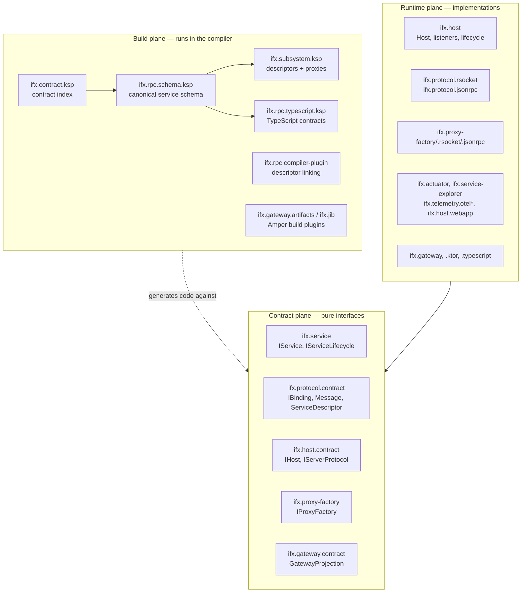
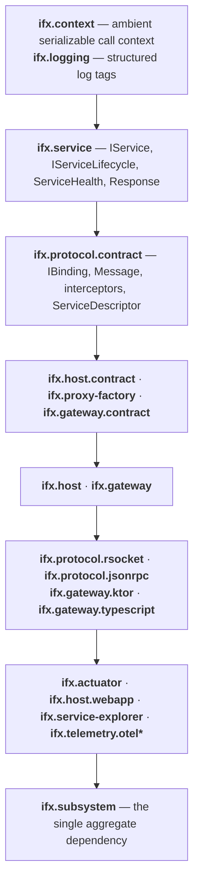

# Architecture overview

Carbide is infrastructure for code. It takes the concerns that every distributed system re-implements —
hosting, invocation, serialization, context propagation, logging, health, diagnostics, tooling — and
puts them behind a small set of contracts so that application code contains only business behaviour.

The unit of design is a **Kotlin interface extending `IService`**. Everything else in the framework
exists to carry that interface across a process boundary without the author writing transport code,
DTO mapping, route tables, or registration lists.

```kotlin
interface IProductAccess : IService {
    suspend fun filter(criteria: ProductCriteria): List<Product>
    fun stream(criteria: ProductCriteria): Flow<Product>
    @FireAndForget suspend fun record(event: ProductEvent)
}
```

That declaration is the only artifact the author writes. The server binding, the client proxy, the
wire schema, the OpenAPI document, and the TypeScript SDK are all derived from it.

## The three planes

Carbide splits into three planes that touch each other only through generated code and contracts.



**Contract plane** modules contain interfaces and serializable data only. They pull in no transport,
no server, and no generated code. A service module depends on `ifx.service`, which supplies and
exports the common context, logging, and standard-library facilities.

**Runtime plane** modules implement those contracts. They are chosen at the application's composition
root, not by the service author. Swapping RSocket for JSON-RPC changes one line in the host builder
and no service code.

**Build plane** tools are `compile-only` KSP processors, a Kotlin IR compiler plugin, and Amper build
plugins. They are never runtime dependencies of the artifacts they produce. See
[Code generation pipeline](code-generation.md).

## Dependency layering

Dependencies point downward only. Nothing in a lower layer knows a higher layer exists.



Two consequences follow from this ordering:

- `ifx.protocol.contract` has **no transport dependency at all**. `IBinding`, `Message`, interceptors,
  and descriptors are pure Kotlin. This is what lets a gateway, a test double, and an in-process
  binding all be `IBinding` implementations.
- Ktor first appears at `ifx.host.contract`, because `IServerProtocol.install` receives a Ktor
  `Application`. That is a deliberate, documented coupling — see
  [Design decisions](design-decisions.md#ktor-in-the-host-contract).

## The pivot abstraction: `IBinding`

Every part of Carbide that moves a call is an `IBinding`:

```kotlin
interface IBinding {
    suspend fun fireAndForget(operation: String, message: Message): Unit
    suspend fun requestResponse(operation: String, message: Message): Message
    suspend fun requestStream(operation: String, message: Message): Flow<Message>
}

data class Message(val header: String, val body: String)
```

Three interaction types, an operation name, and a message of two JSON strings — headers separate
from body. That is the whole transport contract.

The generated client proxy calls an `IBinding`. The interceptor pipeline *is* an `IBinding` wrapping
another one. The RSocket and JSON-RPC clients are `IBinding`s. The generated server binding is an
`IBinding` that dispatches to the service instance. A gateway is an `IBinding` that routes to other
bindings. Because the abstraction is uniform, an interceptor written once works on both sides of the
wire and under every protocol.

## Serving and calling

The two halves of the framework are `Host` (serve) and `IProxyFactory` (call). They are symmetric and
meet at `IBinding`.

```mermaid
flowchart LR
    subgraph client["Calling subsystem"]
        app1["Manager code"]
        proxy["Generated proxy<br/>ISalesManagerProxy"]
        cpipe["InterceptorPipeline CLIENT<br/>registration order"]
        cprot["RSocketClientProtocol"]
    end

    subgraph server["Serving subsystem"]
        sprot["RSocketServerProtocol<br/>listener :7000"]
        spipe["InterceptorPipeline SERVER<br/>reverse order"]
        bind["Generated server binding"]
        impl["SalesManagerImpl"]
    end

    app1 -->|"typed call"| proxy
    proxy -->|"IBinding"| cpipe
    cpipe -->|"IBinding"| cprot
    cprot ==>|"WebSocket / RSocket frames<br/>route = service address"| sprot
    sprot -->|"IBinding"| spipe
    spipe -->|"IBinding"| bind
    bind -->|"typed call"| impl
```



Reversing the interceptor order on the server makes a shared list symmetric — `[logging, encryption]`
on both sides produces `client logging → client encryption → transport → server encryption → server
logging`. See [Call path and interceptors](call-path.md).

### Host

`Host` owns service registration and the lifecycle of its Ktor servers.

- A host has one or more **listeners**. Each listener is one `IServerProtocol` on its own port and
  network interface. Protocols never share a Ktor `Application`, so their routes, plugins, TLS, and
  authentication cannot collide.
- A listener installs an **endpoint set**. By default it is the registered services; an
  `EndpointSource` can replace it with an immutable projection — this is the seam the gateway uses.
- **Host extensions** (`WebApp`, `ServiceExplorer`, `HealthEndpoints`) are declared inside the listener
  they extend and add routes to it without being services. An extension may declare a
  `requiredProtocolId`, which the listener checks when it is installed.
- The host drives `IServiceLifecycle` (`start` / `health` / `stop`) locally. Lifecycle methods are
  never exposed as remote operations.
- `HostState` runs `NEW → STARTING → READY → DRAINING → STOPPING → STOPPED` (or `FAILED`), with
  `drainDelay` for endpoint propagation and `requestDrainTimeout` bounding in-flight work.

### Proxy factory

`IProxyFactory` owns the client transport and is therefore long-lived: one per subsystem, not one per
call.

- `create<T>()` returns a generated proxy. It is cheap and repeatable because bindings are cached by
  `(destination, service address)` — one connection per pair.
- `at(endpoint)` returns a lightweight view bound to another destination that **shares** the parent's
  transport, interceptors, binding cache, and lifecycle.
- `close()` releases connections. Proxies survive as objects but can no longer call.

## Composition root

An application assembles Carbide in one place. `Host.development()` from `ifx.subsystem` is the opinionated
development assembly:

```kotlin
val host = Host.development(name = "Sales", rsocketPort = 8080, jsonRpcPort = 8081)
host.registerService<ISalesManager> { SalesManagerImpl(proxyFactory) }
host.start()
```

That single call composes: an RSocket listener, a JSON-RPC listener, the `IActuator` utility service,
Kubernetes probes at `/ifx/health`, `/ifx/health/ready`, `/ifx/health/live`, and the browser Service
Explorer at `/`. It is deliberately unauthenticated. Production applications construct `Host`
directly with the builder and expose only their intended protocols and utilities; nothing in
`Host.development()` is privileged.

## What Carbide gives a service author for free

| Concern | Mechanism | Module |
| --- | --- | --- |
| Remote invocation | Generated descriptor, proxy, and server binding | `ifx.subsystem.ksp` |
| Wire format | JSON with headers separate from body | `ifx.protocol.contract` |
| Transport choice | Listener per protocol; same services on all of them | `ifx.protocol.*` |
| Ambient call context | Mandatory `ContextInterceptor`, serialized into a reserved header | `ifx.context` |
| Cross-cutting behaviour | `IInterceptor` onion around the whole invocation | `ifx.protocol.contract` |
| Structured logging | `Log` and `LogTag`; the host supplies the current registered service identity through `ServiceLogScope` | `ifx.logging` + `ifx.host` |
| Diagnostics | `IActuator` catalog, per-service health, streaming log tail | `ifx.actuator` |
| Interactive exploration | Browser Service Explorer driven by the runtime wire schema | `ifx.service-explorer` |
| Distributed tracing | W3C traceparent propagation, OTLP/HTTP export | `ifx.telemetry.otel` |
| Public API surface | Gateway projection → RSocket, HTTP, OpenAPI, TS SDK | `ifx.gateway.*` |
| Container image | Jib build plugin, distroless base | `ifx.jib` |

## Reference architecture roles

The reference system classifies modules as **Client, Manager, Engine, ResourceAccess, Utility, Resource**.
The mapping to Carbide is direct:

| Methodology role | Carbide expression |
| --- | --- |
| Manager, Engine, ResourceAccess | An `IService` contract plus its implementation, registered on a host |
| Utility | An `IUtility` contract (`IActuator` is the built-in example); shown separately in the catalog |
| Client | A generated TypeScript SDK, or another subsystem holding a proxy |
| Allowed dependency | Which descriptors a subsystem's dependency graph makes reachable |
| Published API | A `GatewayProjection` over Manager operations |

The modules under `test.*` are laid out in exactly these terms
(`manager/sales`, `engine/pricing`, `access/product`) and are the executable example.
