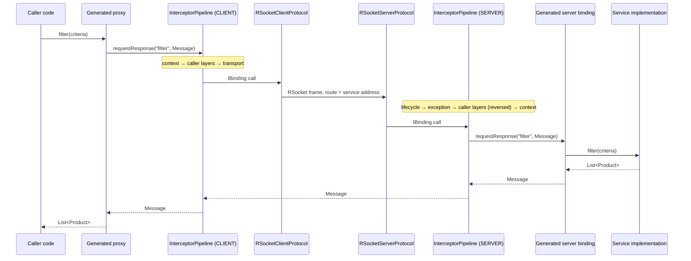
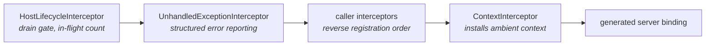
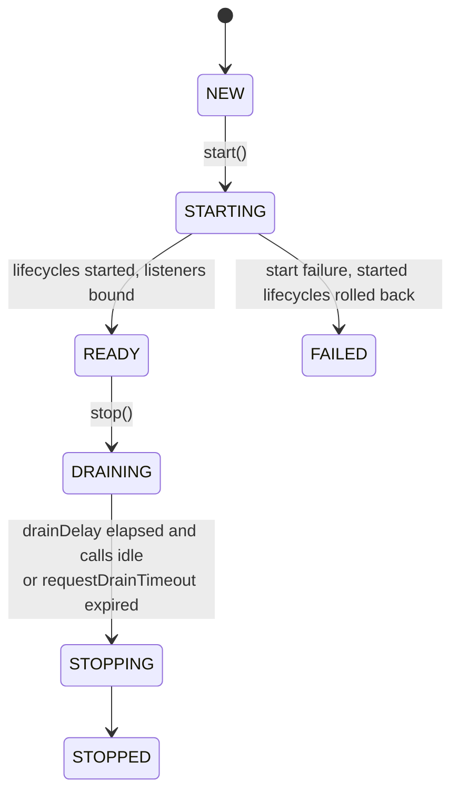

# Call path and interceptors

This document follows one invocation from a typed Kotlin call to a service implementation and back,
and explains the extension model layered on it.

## The invocation model

All three interaction types are represented as **one cold `Flow<Message>`**:

| Interaction | Trigger | Flow emits |
| --- | --- | --- |
| `fireAndForget` | suspending `Unit` operation marked `@FireAndForget` | nothing; the pipeline `collect()`s it |
| `requestResponse` | any ordinary suspending operation | exactly one message; the pipeline takes `single()` |
| `requestStream` | operation returning `Flow<T>` | zero or more messages, passed through |

One model for all three is the point. It means an interceptor's `try`/`finally` surrounds the complete
lifetime of a stream, not just its subscription — so cleanup, failure handling, cancellation, and
telemetry spans behave identically whether an operation returns a value or a million of them.

A suspending `Unit` operation **without** `@FireAndForget` is request/response and waits for the
service to finish. One-way is opt-in, because silently dropping the completion signal is not a
default anyone should get by accident.

## End to end



### Message encoding

```kotlin
data class Message(val header: String, val body: String)
```

Two independent JSON strings. The body is the serialized argument or result; the header is a JSON
object of named entries. Keeping them separate is what allows an interceptor to read or rewrite
metadata (`Message.headers()`, `Message.withHeader(k, v)`) without parsing or re-encoding the payload,
and what lets an unknown header pass through a system that does not understand it.

`RpcFormat` — the shared `Json` configuration — has `encodeDefaults = true` and no pretty printing.

### Routing

The **service address** (the contract's fully qualified name) is the route on the transport: an
RSocket route per address, a JSON-RPC endpoint per address. `Endpoint` and `ServiceDescriptor` both
derive `address` from their `ServiceDescription`, so an endpoint cannot be routed under one address
while describing itself as another. The **operation name** is carried inside
the call and dispatched by the generated `when (operation)` in the server binding. Address is also the
binding-cache key on the client and the identity in the actuator and log tail.

## The interceptor onion

```kotlin
fun interface IInterceptor {
    fun intercept(call: InterceptorCall, next: InterceptorChain): Flow<Message>
}
```

`InterceptorPipeline` is itself an `IBinding`. It folds the interceptor list right-to-left into a
chain terminating in the next binding, so each interceptor sees the complete invocation:

```kotlin
class TimingInterceptor : IInterceptor {
    override fun intercept(call: InterceptorCall, next: InterceptorChain): Flow<Message> = flow {
        val started = TimeSource.Monotonic.markNow()
        try {
            emitAll(next(call))
        } finally {
            println("${call.operation}: ${started.elapsedNow()}")
        }
    }
}
```

`InterceptorCall` carries a `direction` of `CallDirection.CLIENT` or `CallDirection.SERVER` alongside
`service`, `interactionType`, `operation`, and `message`, so a layer can behave asymmetrically when it
must. One `InterceptorPipeline` class serves both sides; the direction decides both the call it builds
and whether the interceptor list is reversed.

### Ordering

Client interceptors run in **registration order**; server interceptors run in **reverse**. A single
shared list therefore produces a symmetric onion:

```text
client logging → client encryption → transport → server encryption → server logging → service
```

This is why `[logging, encryption]` works on both sides without a separate server list, and why the
`Rot13Interceptor` example in `ifx.protocol.contract` is a useful sanity check: an encoder that is
not symmetric will fail visibly.

### Mandatory interceptors

Every `Host` installs three layers per registered service that callers cannot remove or reorder. The
server list is assembled as `[context] + caller layers + [exception, lifecycle]` and then reversed,
giving this execution order from the outside in:



- **`HostLifecycleInterceptor`** is outermost so it counts the whole invocation. It refuses new calls
  once the host begins draining — except utility `health()`, which must keep answering probes — and
  decrements the in-flight count in a `finally`, which is what `requestDrainTimeout` waits on.
- **`UnhandledExceptionInterceptor`** logs any non-`CancellationException` escaping the service with
  the service interface, implementation class, and operation as its structured path, then **re-throws
  the original**. Reporting never replaces the failure or changes the transport's error response, and
  a failure inside the reporter itself is swallowed rather than masking the real one.
- **`ContextInterceptor`** is innermost on the server, so caller layers that decrypt or decode headers
  have already run before context is extracted.

`host.interceptors` exposes `[context] + caller layers` in **client** order — the client-safe mirror.
`RSocketProxyFactory.forHost(host)` copies exactly that onto the client, which is how a proxy created
from a host is automatically symmetric with it. The lifecycle and exception layers are server-only and
are not mirrored.

Interceptors must be added before any service is registered; `addInterceptors` after that point fails.

## Context propagation

`Context` is an immutable `CoroutineContext.Element` holding `Map<String, JsonElement>`. It has **no
predefined application fields** — Carbide does not decide what a caller, a tenant, or a request id is.

```kotlin
@Serializable
@SerialName("ifx.caller")
data class Caller(val subject: String)

withContext(Context().set(Caller("user-42"))) {
    client.awesome(request)
}
```

- Values are serialized **on `set`**, using their `@SerialName` as the key. That name is the value's
  cross-system identity, so it must be stable.
- `ContextInterceptor` on the client reads `Context.current()` and writes it into the reserved header
  `ifx.context`. On the server it reads that header and installs the context with `flowOn`, so it
  covers the whole invocation including stream collection.
- The server reads it with `Context.current().getOrNull<Caller>()`.
- A value whose type the receiving system does not know stays opaque JSON and propagates onward
  untouched.

### Trusted context

Protocol authenticators establish context the client cannot forge. `RSocketSetupAuthenticator`
authenticates one SETUP payload and returns context trusted for the entire connection, **overwriting**
anything the client supplied. `GatewayAuthenticator` does the same per HTTP request. This is the
intended place for identity: authenticate at the edge, propagate as context, read it as a typed value
in the service.

## Failure, cancellation, and timeouts

- Every failure — dropped transport, remote service exception, exhausted connect budget — reaches the
  caller as `ProtocolException` with the underlying cause attached. RSocket and JSON-RPC clients agree
  on this.
- Cancelling the caller propagates as cancellation, so `withTimeout` and structured concurrency behave
  normally. `CancellationException` is never treated as a service failure.
- A remote error travels as a per-stream error frame and leaves the shared connection intact.
- **Calls have no built-in deadline.** Only acquiring a connection is bounded by a client-side timeout.
  An application deadline belongs to the caller: wrap the call in `withTimeout`.
- **A failed call is never replayed.** Carbide will not silently retry a non-idempotent operation.
- Because calls carry no timeout, the RSocket **keep-alive** sets the worst case for noticing a dead
  peer. The protocol default (20 s interval, 90 s lifetime) means a call can hang roughly 110 s;
  tighten `KeepAlive` per factory when that is too slow. Each connection negotiates its own window, so
  a browser can keep a more generous one than a backend peer.

## Host lifecycle



- `registerService` is only legal in `NEW`.
- `start()` starts every `IServiceLifecycle` in registration order, then binds listeners, then begins
  accepting calls. A failure rolls back started lifecycles in reverse order, adding any secondary
  failure as suppressed, and lands in `FAILED`.
- `stop()` enters `DRAINING` first. `drainDelay` should match the deployment's endpoint-propagation
  window — the time a load balancer or Kubernetes endpoint controller needs to stop sending traffic —
  and defaults to zero so local shutdown is immediate. `requestDrainTimeout` (20 s) bounds how long
  the host waits for accepted calls and streams before stopping services and listeners.
- `health()` aggregates per-service `IServiceLifecycle.health()` under `healthCheckTimeout`, and is
  published both through `IActuator.health()` and the Kubernetes probes at `/ifx/health`,
  `/ifx/health/ready`, `/ifx/health/live`.
- `onStop(action)` ties a resource's lifetime to the host's; actions run in reverse registration
  order, and every action runs even if an earlier one throws.

## Observability layers

Interceptors are how observability enters the pipeline, which is why ordering matters:

```kotlin
host.addInterceptors(listOf(telemetry, Encryption))
proxyFactory.addInterceptors(host.interceptors)
```

Place `telemetry` **before** any layer that encodes or encrypts headers. The server reverses the list,
so decryption runs before the telemetry layer tries to extract `traceparent`.

`ifx.telemetry.otel` propagates W3C `traceparent` / `tracestate` and exports OTLP/HTTP JSON. Put a
bounded `BatchSpanProcessor` between the interceptor and exporter so collector I/O stays off the RPC
path. Its `onDroppedSpans` callback reports queue overflow, shutdown rejection, timeout, and export
failure without changing the RPC outcome. The processor does not retry; application shutdown must
call its suspending `shutdown()` to drain queued spans and close the exporter.

An optional `RpcMetrics` recorder measures client and server call duration independently of trace
sampling. It aggregates low-cardinality method, interaction, and error series in memory and exports
cumulative OTLP histograms periodically rather than performing collector I/O in the RPC path.

Set `logRpcCalls = true` on the telemetry interceptor to emit request and response logs carrying
`trace_id`, `span_id`, and `trace_flags` in their structured tags.
