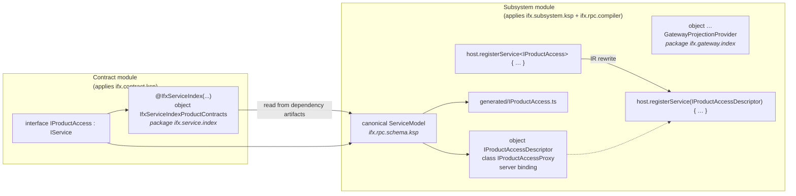

# Code generation pipeline

Nothing in Carbide discovers services at runtime. There is no classpath scanning, no reflection, no
service-locator registry, and no annotation on the contract. The wiring is resolved entirely at
compile time by four cooperating tools, and **the subsystem's dependency graph is the manifest** —
adding or removing a service-module dependency changes what is generated, with no second list to
maintain.



`ifx.rpc.schema.ksp` is the single symbol-to-wire-schema implementation shared by both generators.
It validates operations and serialization shapes, then produces one compiler model. The subsystem
processor renders that model into the runtime `ServiceDescription`; the optional TypeScript
processor renders the same model into TypeScript. Gateway TypeScript and OpenAPI generation consume
the resulting runtime description and never reinterpret Kotlin symbols.

## Stage 1 — `ifx.contract.ksp`: the contract index

Applied to **modules that declare service contracts**, and to nothing else.

```yaml
settings:
  kotlin:
    ksp:
      processors:
        - io.carbide-ifx:ifx.contract.ksp:<version>
```

It finds every non-private interface in the module assignable to `IService` (excluding the framework
markers `IService` and `IUtility` themselves), and emits **one** object into the reserved package
`ifx.service.index`:

```kotlin
package ifx.service.index

@IfxServiceIndex(
    "access.product.contract.IProductAccess",
    "manager.sales.contract.ISalesManager",
)
public object IfxServiceIndexProductContracts
```

That is the entire output: a list of qualified names, sorted for determinism, named after the module.
No descriptor, no proxy, no protocol dependency. A contract module therefore stays free of transport
code and can be published and consumed by anyone.

## Stage 2 — `ifx.subsystem.ksp`: descriptors, proxies, and bindings

Applied only to **subsystem / application modules** — those that actually host or call services.

```yaml
settings:
  kotlin:
    ksp:
      processors:
        - io.carbide-ifx:ifx.subsystem.ksp:<version>
    compilerPlugins:
      - id: ifx.rpc.compiler
        dependency: io.carbide-ifx:ifx-rpc-compiler-plugin:<version>
```

The processor collects contracts from two sources and merges them:

1. interfaces declared locally in this module, and
2. every name listed by an `@IfxServiceIndex` object reachable in package `ifx.service.index` — that
   is, the indexes of all dependency modules.

For each contract not already having a descriptor, it emits one file beside the contract's package:

```kotlin
private class IProductAccessProxy(private val binding: IBinding) : IProductAccess { … }

public object IProductAccessDescriptor : ServiceDescriptor<IProductAccess> {
    override val contract = IProductAccess::class
    override val address = "access.product.contract.IProductAccess"
    override val description = ServiceDescription(…)   // full runtime wire schema
    public val filter: OperationDescriptor<IProductAccess, ProductCriteria, List<Product>> = …
    override fun createClient(binding: IBinding): IProductAccess = IProductAccessProxy(binding)
    override fun bind(instance: IProductAccess): IBinding = object : IBinding { … }
}
```

Three artifacts in one object:

- **the client proxy** — encodes arguments to a `Message`, calls the right `IBinding` method, decodes;
- **the server binding** — a `when (operation)` dispatch per interaction type, back to the instance;
- **the description** — a serializable `ServiceDescription` including every reachable type, which is
  what the Service Explorer, OpenAPI renderer, and TypeScript renderer consume at runtime.

Plus a typed `OperationDescriptor` property per operation, which is what makes the gateway DSL's
`only(filter, stream)` compile-time checked against the owning service.

Interaction type is derived from the signature: a `Flow` return is a request stream, a `@FireAndForget`
suspending `Unit` is fire-and-forget, everything else is request/response. `IServiceLifecycle` members
are never generated as operations.

### Gateway projection index

In the same run, the processor scans for every non-private, non-mutable top-level `val` whose inferred
type is `GatewayProjection` and emits a `GatewayProjectionProvider` into `ifx.gateway.index`, plus a
`META-INF/services` entry. No annotation and no projection-name string is required. A `private` or
`var` projection is a compile error, because the build index must reference one static value.

Only indexes generated into the declaring module's **own** JAR are loaded, so a gateway module never
accidentally publishes the projections of its dependencies.

### Multiplatform and the two-round Native protocol

On Native, dependency KLIB indexes are not visible in the first KSP round. The processor therefore
emits an empty anchor object into `ifx.service.index` on round one, which makes the package exist; on
the next round it reads the dependency indexes and generates normally. This keeps dependency
aggregation automatic on Native without an explicit contract list.

In a multiplatform application, descriptors are emitted into each platform source set and the compiler
plugin links them directly on JVM and Native. Host assembly belongs in the corresponding platform
source sets.

## Stage 3 — `ifx.rpc.compiler-plugin`: descriptor linking

The reified conveniences are intrinsics with no body:

```kotlin
inline fun <reified T : IService> IProxyFactory.create(): T = missingIfxCompilerPlugin()
```

Called without the plugin they fail with an explicit message. The Kotlin IR extension rewrites them,
in the *consuming* module, into the real descriptor-taking overload:

| Written | Compiled to |
| --- | --- |
| `host.registerService<IProductAccess> { impl }` | `host.registerService(IProductAccessDescriptor) { impl }` |
| `proxyFactory.create<IProductAccess>()` | `proxyFactory.create(IProductAccessDescriptor)` |

If the type argument is not concrete, or no generated descriptor exists for it, compilation fails with
a message naming the contract and telling you to apply `ifx.subsystem.ksp` to the consuming module.

The plugin does a second job: **filling defaulted `ServiceDescriptor<T>` parameters**. Any function
with a `descriptor: ServiceDescriptor<T> = …` parameter gets its generated descriptor injected at the
call site. This is why `Host.development()` and `registerActuator()` work in application code while
`ifx.actuator` itself still generates only a contract index — the framework cannot know the
application's descriptors, so the application's compiler supplies them. Reusable helpers can use the
same pattern.

Code compiled without the plugin is not locked out; it passes descriptors explicitly:

```kotlin
host.registerService(IProductAccessDescriptor) { ProductAccessEmulator() }
val client = proxyFactory.create(IProductAccessDescriptor)
```

## Stage 4 — `ifx.rpc.typescript.ksp`: TypeScript contracts

Optional, applied alongside `ifx.subsystem.ksp`. For each contract it emits a TypeScript service
interface, request/response type aliases, all reachable serializable types, a `{Service}Description`
value carrying the same runtime wire schema, and a concrete protocol-neutral `{Service}Sdk`.
Service method overloads are rejected with a compile-time diagnostic. Although Kotlin can route them
by parameter signature, they do not have a stable, portable public identity in generated TypeScript
SDKs and gateway projections; use distinct operation names instead.

Request and response types must be `@Serializable`. Custom and contextual serializers are **rejected**,
because their wire shape cannot be inferred from KSP symbols — the generator refuses rather than
guessing. These rules come from `ifx.rpc.schema.ksp`, so descriptor and TypeScript generation cannot
disagree about the wire schema.

## Build-plugin artifacts

`ifx.gateway.artifacts` is an Amper plugin adding a `gatewayArtifacts` task to a module that already
runs `ifx.subsystem.ksp`. It loads the generated projection index from the module's own JAR and writes
one deterministic directory per public gateway address — **without starting a host**:

```text
gateway/
├── product-web/{sdk.ts, openapi.json}
└── product-web/v2/{sdk.ts, openapi.json}
```

That directory is the build/publishing boundary: npm and API-catalog jobs consume it without loading
a runtime or duplicating the DSL in build configuration.

`ifx.jib` is an unrelated Amper plugin producing container images (`jibTar`, `jibDocker`, `jibPush`)
from a runnable JVM subsystem module.

## Guarantees

- Generation never exposes a contract. Only `registerService` publishes an endpoint.
- Descriptor linking uses no runtime lookup, classpath scanning, reflection, or associated-object
  mutation of dependency contracts.
- Output is deterministic: contracts are sorted by qualified name, and KSP dependencies are declared
  as aggregating so incremental builds stay correct.
