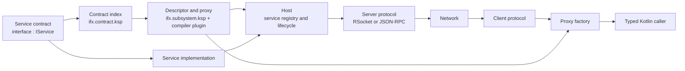

# iFX design

iFX turns ordinary Kotlin service interfaces into remotely callable services. A contract stays
independent of transports; build-time generation creates its descriptor and proxy; a host binds an
implementation to one or more protocols; clients call it through a typed proxy.

This document describes the architecture implemented by the current repository. Module names are
included to make ownership and dependency decisions explicit.

## The system at a glance



There are three important boundaries:

1. **Contract boundary.** A contract module depends only on `ifx.service` and serialization types.
   It has no host or transport dependency.
2. **Subsystem boundary.** An application or subsystem chooses which reachable contracts to host,
   which implementations to register, and which protocols to expose.
3. **Transport boundary.** Protocol modules translate the common iFX invocation model to a wire
   protocol. Service code and callers remain typed Kotlin.

## Component groups

### 1. Service model

| Module | Responsibility |
| --- | --- |
| `ifx.service` | Minimal service API: `IService`, optional `IServiceLifecycle`, typed `Response`, error codes, and fire-and-forget marking. |
| `ifx.context` | Immutable invocation context propagated across service calls. |
| `ifx.logging` | Structured logging identities and writer integration. |

`IService` is deliberately only a contract marker. It does not start a server, select a transport,
or register an implementation. A resource-owning implementation can additionally implement
`IServiceLifecycle`; the host invokes its local `start`, `health`, and `stop` methods.

### 2. Generated contract metadata

| Module | Responsibility |
| --- | --- |
| `ifx.contract.ksp` | Writes a small index for each module that declares `IService` contracts. |
| `ifx.subsystem.ksp` | Reads reachable contract indexes in the consuming subsystem and generates service descriptors and proxies. |
| `ifx.rpc.compiler-plugin` | Rewrites typed calls such as `registerService<T>()` and `create<T>()` to pass the generated descriptor directly. |
| `ifx.rpc.typescript.ksp` | Optionally generates TypeScript contracts and serializable wire types. |

The dependency graph is the contract manifest: a subsystem gets generated bindings for the
contract modules it depends on. There is no runtime classpath scan, reflection-based registry, or
second hand-maintained service list. Generation makes a contract available to code; only explicit
host registration exposes it at runtime.

### 3. Common invocation and protocol contracts

| Module | Responsibility |
| --- | --- |
| `ifx.protocol.contract` | Transport-neutral messages, service and operation descriptors, endpoint bindings, serialization, interaction types, and interceptor pipelines. |
| `ifx.protocol.rsocket` | RSocket server and client support for fire-and-forget, request/response, and request-stream calls. |
| `ifx.protocol.jsonrpc` | JSON-RPC over HTTP server and client support for notifications and request/response calls. |

All interactions are represented internally as a cold `Flow<Message>`. This gives interceptors one
model around the complete invocation: zero emitted messages for fire-and-forget, one for
request/response, and multiple for a stream. JSON-RPC rejects streaming operations explicitly
because regular JSON-RPC has no corresponding streaming interaction.

### 4. Hosting

| Module | Responsibility |
| --- | --- |
| `ifx.host.contract` | Host, server-protocol, listener, endpoint-source, and extension contracts. |
| `ifx.host` | Service registration, Ktor listener lifecycle, service lifecycle, health checks, draining, and mandatory interceptors. |
| `ifx.subsystem` | The public runtime bundle and the opinionated `Host.default()` composition. |
| `ifx.host.webapp` | Mounts an already-built web application directory on a listener. |

A `Host` owns service instances and listeners. Registration binds a generated descriptor to an
implementation and creates an endpoint. Each listener has one protocol and one port, but listeners
may expose either all registered endpoints or an immutable projection of them.

`Host.default()` is the normal application entry point. It composes:

- an RSocket listener;
- a JSON-RPC listener;
- the `IActuator` utility service;
- readiness and liveness endpoints; and
- the browser-based Service Explorer on the RSocket listener.

Construct `Host` directly when the subsystem needs different listeners, authentication, endpoint
projections, or tooling.

### 5. Typed clients

| Module | Responsibility |
| --- | --- |
| `ifx.proxy-factory.contract` | Typed proxy-factory API. |
| `ifx.proxy-factory.base` | Shared proxy and binding behavior. |
| `ifx.proxy-factory.rsocket` | Long-lived RSocket client transport and typed proxies. |
| `ifx.proxy-factory.jsonrpc` | JSON-RPC client transport and typed proxies. |

A proxy factory owns its transport connections and should normally live for the lifetime of its
subsystem. `create<T>()` is cheap: bindings are cached by destination and service address. A factory
can target the local host or a remote `ServiceEndpoint`; service implementations can therefore call
other services through the same typed API regardless of deployment topology.

### 6. Cross-cutting runtime features

| Module | Responsibility |
| --- | --- |
| `ifx.actuator` | Service catalog, per-service health, retained log tails, and HTTP health endpoints. |
| `ifx.service-explorer` | Bundled browser UI backed by the actuator and RSocket APIs. |
| `ifx.telemetry.otel` | W3C trace propagation and OTLP/HTTP span export through an interceptor. |

Interceptors surround client and server invocations. The host always installs context propagation
and unhandled-exception reporting. Application interceptors add logging, tracing, authentication,
encryption, or other policies. Client order is mirrored in reverse on the server to form an onion
around the transport and service invocation.

### 7. Gateway and external API projection

| Module | Responsibility |
| --- | --- |
| `ifx.gateway.contract` | Static gateway projection model and DSL. |
| `ifx.gateway` | Binds projections to local or remote service targets. |
| `ifx.gateway.ktor` | Conventional HTTP adapter and OpenAPI rendering. |
| `ifx.gateway.typescript` | TypeScript SDK rendering for a projection. |
| `ifx.gateway.artifacts` | Build plugin that emits deterministic OpenAPI and SDK artifacts. |

A gateway does not define another service layer. It selects and optionally renames operations from
existing generated descriptors. The same projection can be exposed by an embedded host or bound to
remote service targets in a separate gateway process.

### 8. Build, packaging, testing, and supporting utilities

| Module | Responsibility |
| --- | --- |
| `ifx.jib` | Amper plugin for building, loading, or pushing JVM subsystem container images. |
| `ifx.testing` | Shared service-testing support. |
| `utility.stdlib` | General multiplatform utility types. |
| `utility.db` | JVM database utilities; useful alongside iFX but not part of the RPC call path. |
| `test.service-contracts` | Example contracts used by repository integration tests. |
| `test.test-system` | Executable reference subsystem with Access, Engine, and Manager services. |
| `test.gateway` | Executable examples and tests for gateway projections. |

The TypeScript packages under `typescript/` provide the protocol-neutral generated SDK runtime and
RSocket, JSON-RPC, and HTTP bindings.

## Runtime call path

For a normal request/response call:

1. Application code calls a generated typed proxy.
2. The proxy serializes the request using its generated `OperationDescriptor`.
3. Client interceptors wrap the invocation and the selected client protocol sends it.
4. The server protocol resolves the service address and operation against the host endpoint source.
5. Server interceptors restore context and apply application policies.
6. The generated binding deserializes the request and calls the registered Kotlin implementation.
7. The result follows the same path back and is deserialized to the declared Kotlin return type.

Transport failures and unhandled remote exceptions surface as `ProtocolException`. Typed business
failures belong in the service contract, for example as `Response<T>`; caller cancellation remains
normal coroutine cancellation.

## Dependency direction

The intended dependency direction is:

```text
business contract -> ifx.service
business implementation -> business contract + application dependencies
subsystem application -> implementations + ifx.subsystem + build-time generators
protocol/gateway/tooling -> shared iFX contracts, never business implementations
```

Keeping this direction is what allows contracts to remain portable, transports to remain
replaceable, and a subsystem to change from in-process composition to remote calls without changing
the service interface.

## Reference implementation

The smallest complete repository example is `test.test-system`:

- `test.service-contracts` defines `IProductAccess`, `IPricingEngine`, and `ISalesManager`;
- `test.test-system` implements and registers them;
- the pricing engine and sales manager obtain typed dependencies from one long-lived proxy factory;
- `Host.default()` exposes the system over RSocket and JSON-RPC and installs its tooling.

See [Getting started](getting-started.md) for the same path as a consumer-oriented walkthrough.
