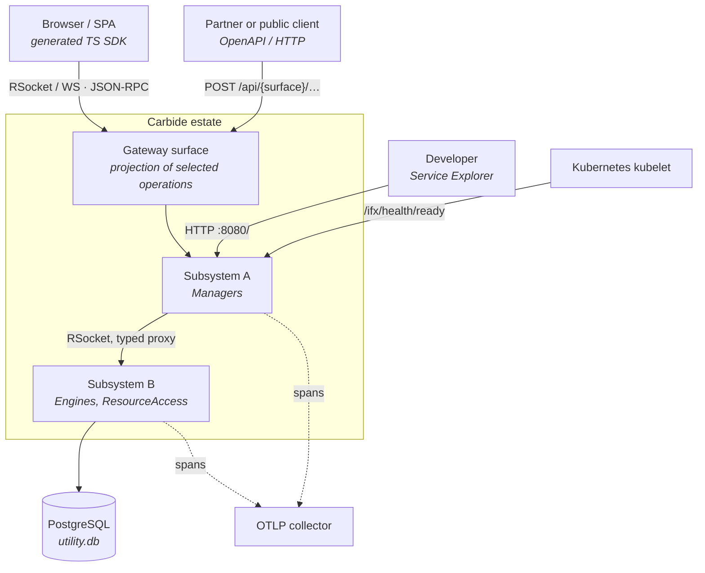
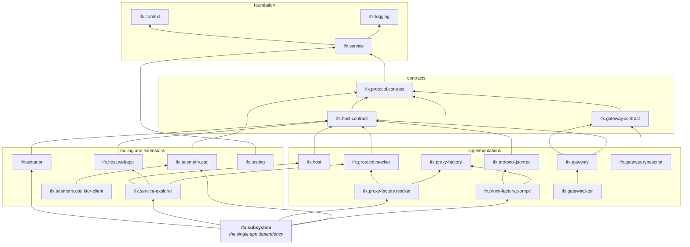
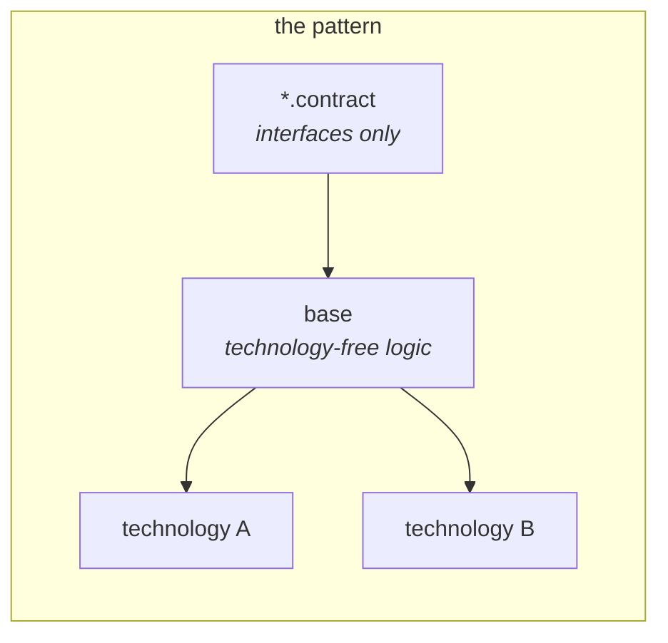
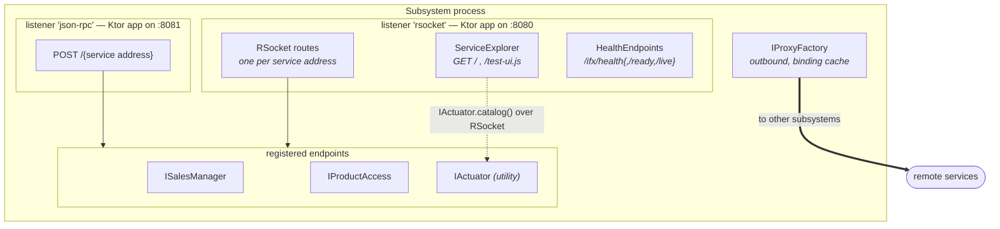
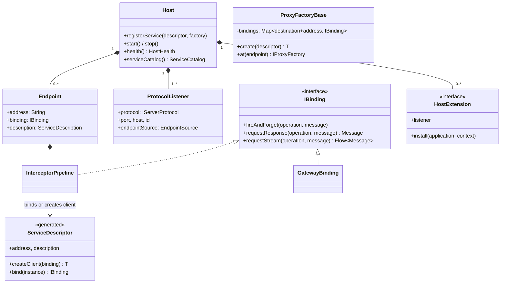
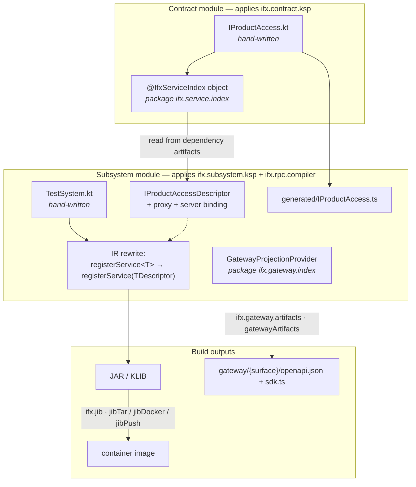
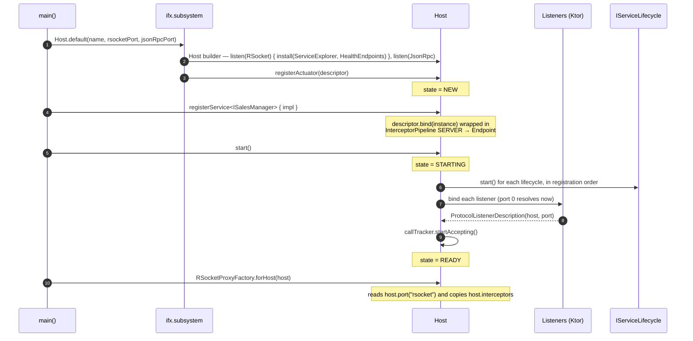
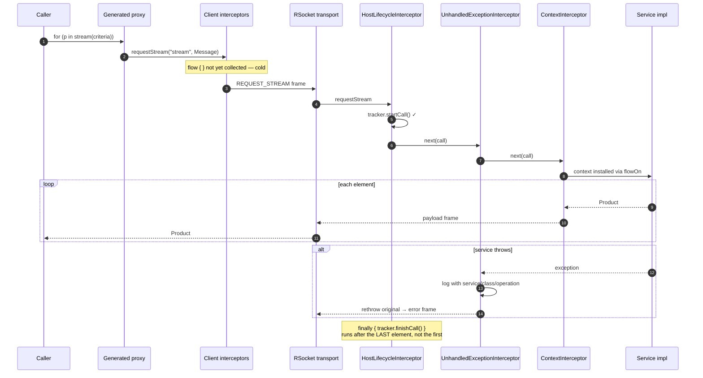
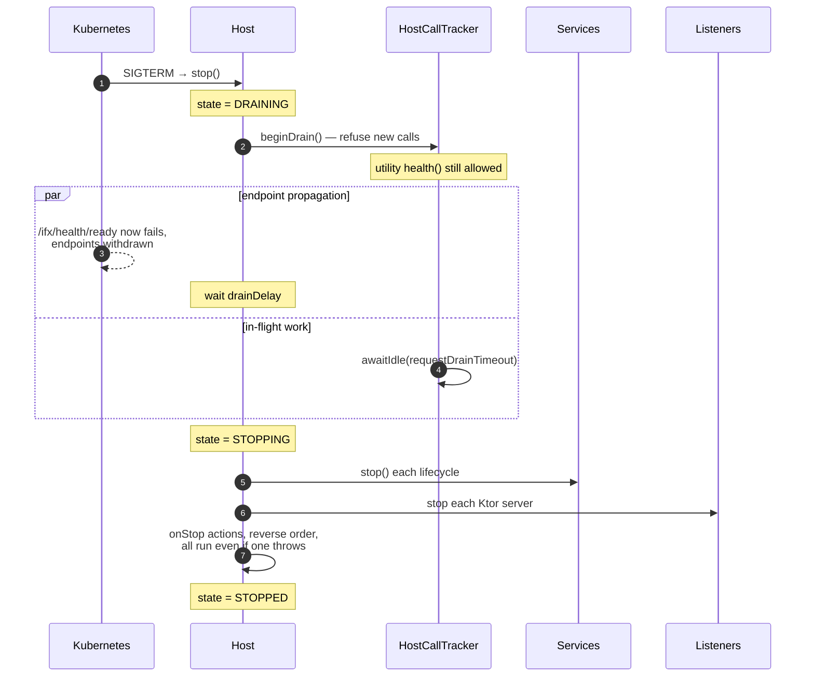
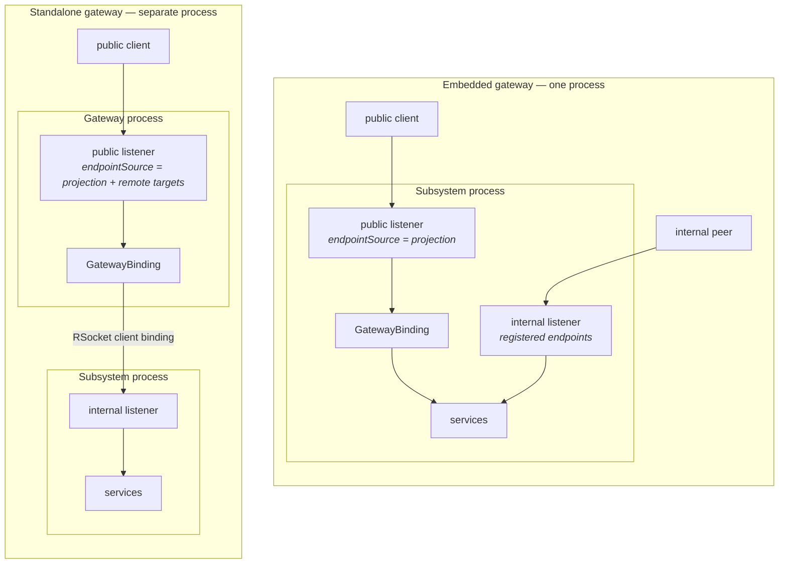

# Diagrams

A visual index of how Carbide fits together, from the outside in. Each diagram is followed by what to
read from it. Diagrams are Mermaid so they render on GitHub and stay diffable in review.

1. [System context](#1-system-context) — what talks to a Carbide system
2. [Module dependency graph](#2-module-dependency-graph) — the real graph, verified against `module.yaml`
3. [The contract / implementation pattern](#3-the-contract--implementation-pattern)
4. [Anatomy of a subsystem process](#4-anatomy-of-a-subsystem-process)
5. [Runtime object model](#5-runtime-object-model)
6. [Build-time pipeline](#6-build-time-pipeline)
7. [Startup sequence](#7-startup-sequence)
8. [A streaming call, end to end](#8-a-streaming-call-end-to-end)
9. [Shutdown and draining](#9-shutdown-and-draining)
10. [Deployment topologies](#10-deployment-topologies)

---

## 1. System context

**Read:** every arrow into the estate is one of four surfaces — a gateway projection, the ordinary
service transport, the Kubernetes probes, or the developer explorer. There is no fifth. Everything
public goes through a projection; everything internal is a typed proxy over the service transport.

---

## 2. Module dependency graph

The **transitive reduction** of the real `ifx.*` production graph: 30 of the 67 declared
`ifx.* → ifx.*` dependencies. The other 37 are implied transitively — a module naming a grandparent
explicitly, which Amper modules do routinely — and are omitted for legibility. Generated from the
`module.yaml` files, not from memory.

**Read:**

- Arrows point *downward* to dependencies. The graph is acyclic and narrow at the bottom:
  `ifx.context` and `ifx.logging` depend on nothing in Carbide.
- `ifx.protocol.contract` is the waist. Everything above it goes through it; it depends only on
  `ifx.service`. This is why `IBinding` can be implemented by a gateway, a test double, or a real
  transport without any of them knowing about each other.
- The three parallel stacks — protocol, proxy-factory, gateway — each have contract → base →
  per-technology modules, and never depend on each other's implementations.
- `ifx.subsystem` is a leaf that only aggregates. Removing it would cost applications a longer
  dependency list and nothing else.
- `ifx.gateway.artifacts` and `ifx.jib` are omitted: they are Amper build plugins, not runtime nodes.

---

## 3. The contract / implementation pattern

The same shape repeats four times. Learn it once.

| Concern | Contract | Base | Technologies |
| --- | --- | --- | --- |
| Serving | `ifx.host.contract` `IHost`, `IServerProtocol` | `ifx.host` `Host` | `ifx.protocol.rsocket`, `ifx.protocol.jsonrpc`, `ifx.gateway.ktor` |
| Calling | `ifx.proxy-factory` `IProxyFactory` + binding cache | — | `ifx.proxy-factory.rsocket`, `ifx.proxy-factory.jsonrpc` |
| Wire | `ifx.protocol.contract` `IBinding`, `Message` | — | any `IBinding` implementation |
| Public API | `ifx.gateway.contract` `GatewayProjection` | `ifx.gateway` `GatewayBinding` | `ifx.gateway.ktor`, `ifx.gateway.typescript` |

**Read:** a technology module is always a leaf. Choosing RSocket over JSON-RPC changes which leaf the
composition root imports — never a contract, never the base, never a service.

---

## 4. Anatomy of a subsystem process

What `Host.default(rsocketPort = 8080, jsonRpcPort = 8081)` actually produces.

**Read:**

- Two listeners, two independent Ktor applications, two ports. They cannot collide on routes or
  plugins, and each is a separate place to terminate TLS or authenticate.
- Both listeners serve the **same** registered endpoint set by default. A gateway changes that by
  supplying an `EndpointSource` to one listener only.
- Host extensions (`ServiceExplorer`, `HealthEndpoints`) are declared inside the listener they extend
  and add HTTP routes to it. They are not services and have no address.
- The explorer has no privileged channel: it reads the catalog through `IActuator` over ordinary
  RSocket, exactly as any other client would.
- The proxy factory is outbound-only and independent of the listeners.

---

## 5. Runtime object model

**Read:** four different things implement `IBinding`, and each is a decoration of the next. An
`Endpoint` is not "a service" — it is an address, a binding, and a description. That is why a gateway,
which has no service instance behind it, is still a perfectly ordinary endpoint.

---

## 6. Build-time pipeline

**Read:** the only hand-written files are the two white boxes. The arrow crossing the module boundary
is the whole aggregation mechanism — a subsystem learns about a contract because it *depends on* the
module that declares it, not because anyone listed it. See
[Code generation pipeline](code-generation.md).

---

## 7. Startup sequence

**Read:** registration is only legal in `NEW`, and interceptors must be added before the first
registration — because the interceptor pipeline is baked into each `Endpoint` at registration time,
not consulted per call. Ports resolve at step 8, which is why `forHost` must come after `start()`.

---

## 8. A streaming call, end to end

The request/response path is in [Call path and interceptors](call-path.md). This is the streaming
case, where the "one invocation is one cold `Flow<Message>`" decision earns its keep.

**Read:** the lifecycle layer's `finally` fires when the stream completes, so a long-running stream
keeps the host out of `STOPPING` until it finishes or `requestDrainTimeout` expires. If interceptors
wrapped only the subscription, draining would cut live streams. The error frame is per-stream — the
shared connection survives.

---

## 9. Shutdown and draining

**Read:** two independent clocks. `drainDelay` covers the *external* race — a load balancer that has
not noticed you yet — and defaults to zero, so it must be set to the deployment's real propagation
window. `requestDrainTimeout` (20 s) covers the *internal* one: calls already accepted. Probes keep
answering throughout, which is why utility `health()` is carved out of the drain gate.

---

## 10. Deployment topologies

The projection is identical in both. Only the `EndpointSource` configuration differs.

**Read:** in both shapes the public port physically cannot reach an unprojected operation — its
listener never installed that endpoint. That is a structural boundary, not a filter someone can forget
to apply. Moving from embedded to standalone means adding `remote(descriptor, protocol)` lines; the
`gateway { }` block does not change. See [Gateway design](gateway.md).
