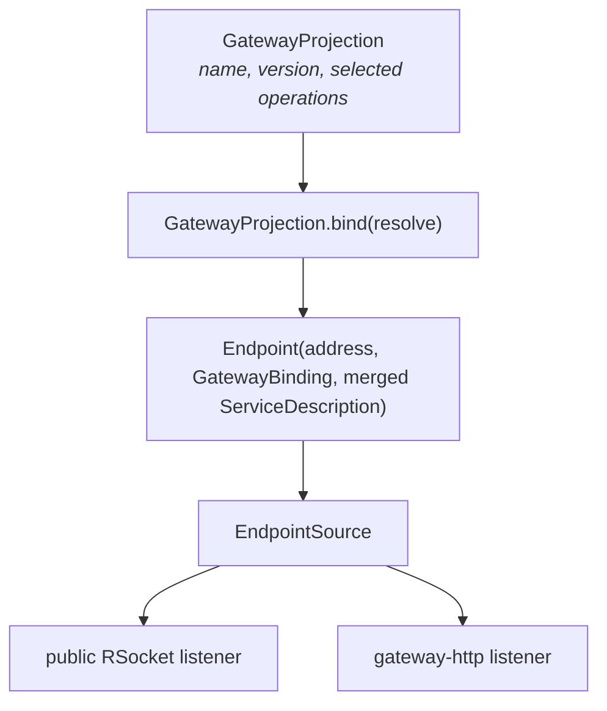

# Gateway design

A Carbide gateway is a **static, transport-neutral projection of existing service operations**. It is not
a service, not a set of routes, and not a second copy of the domain model. In the common case a
gateway contains no DTOs, no mapping code, no annotations, and no duplicate interfaces — only a
selection.

```kotlin
val ProductWebApi = gateway("product-web") {
    expose(IProductAccessDescriptor) {
        only(filter)
    }
    expose(ISalesManagerDescriptor)
}
```

That value is the whole artifact. Everything else — the RSocket surface, the HTTP surface, the OpenAPI
document, the TypeScript SDK — is rendered from it.

## Why a projection rather than a service

The usual API-gateway pattern re-declares an interface, re-declares DTOs, and writes mapping between
them. That duplication is where public APIs drift from the services behind them. A projection instead
*names existing operations*, so a signature change is a compile error in the projection rather than a
silent divergence at runtime.

`expose(descriptor)` includes every ordinary operation on the service, excluding inherited lifecycle
operations. `only(...)` narrows the set, and `named("...")` renames one operation without losing its
identity. The selection is typed:

```kotlin
data class OperationDescriptor<Service : IService, Request, Response>(
    val serviceAddress: String,
    val description: OperationDescription,
)
```

The `Service` type parameter means `only(filter)` inside `expose(IProductAccessDescriptor)` will not
compile if `filter` belongs to another service. The generated descriptor exposes one such
`OperationDescriptor` property per operation, which is what makes the DSL feel like ordinary member
access.

## Naming and addressing

| Element | Convention | Override |
| --- | --- | --- |
| Public surface address | the projection name (`product-web`); `name/vN` when versioned | `version = N` |
| Public service name | conventionalised from the contract name: drop a leading `I`, drop a trailing `Manager`, lowercase the first letter (`IProductAccess` → `productAccess`, `ISalesManager` → `sales`) | `expose(d, asName = "...")` |
| Public operation name | the Kotlin operation name | `operation.named("...")` |
| Route | `{service}/{operation}` | — |

Duplicate public service names, duplicate operation names within a service, `/` in any name, and a
non-positive version are all rejected at construction.

## From projection to endpoint



`bind(resolve)` builds a route table `"{service}/{operation}" → (operation, target IBinding)` and wraps
it in a `GatewayBinding` — itself just an `IBinding`. Because a gateway is an `IBinding`, it plugs into
the same listeners, interceptors, and protocols as any service; no protocol needs to know gateways
exist.

The resulting `Endpoint` carries **one merged `ServiceDescription`**: the union of the projected
operations and every type they reference, with conflicting type names rejected. That single
description is what the OpenAPI renderer, the TypeScript renderer, and any explorer read.

## Two deployment shapes, one projection

The projection does not change between them. Only the `EndpointSource` configuration does.

### Embedded gateway

Give the same endpoint source to each public listener while internal listeners keep the complete
registered endpoint set:

```kotlin
val publicEndpoints = ProductWebApi.endpointSource()

val host = Host {
    listen(RSocketServerProtocol(), id = "internal-rsocket")
    listen(RSocketServerProtocol(rSocketAuthenticator), id = "public-rsocket",
           endpointSource = publicEndpoints)
    listen(GatewayHttpServerProtocol(httpAuthenticator), endpointSource = publicEndpoints)
}
```

Each service resolves to the locally registered binding, so a public call goes through the projection
and then straight into the in-process service — no extra hop, but also no way to reach an unprojected
operation from the public port. Internal and public differ by *which endpoints a listener installs*,
which is a structural boundary rather than a filter someone can forget to apply.

### Standalone gateway process

Keep the projection unchanged and supply typed remote targets:

```kotlin
val publicEndpoints = ProductWebApi.endpointSource {
    remote(IProductAccessDescriptor, productRSocketClient)
    remote(ISalesManagerDescriptor, salesRSocketClient)
}
```

`remote(descriptor, protocol)` creates a client binding while keeping the **service descriptor** as the
configuration key, so a target for a service the projection does not expose is rejected at startup
rather than ignored. `target(descriptor, binding)` accepts an already-created binding.

## Surfaces

### RSocket

One service address — `product-web` — with routes such as `productAccess/filter`. All three
interaction types work. Setup authentication establishes trusted context for the connection and
overwrites any client-supplied context.

### Conventional HTTP (`ifx.gateway.ktor`)

Deliberately **separate from JSON-RPC**, because URLs, envelopes, error shapes, fire-and-forget
responses, and streaming semantics all differ.

| Route | Purpose |
| --- | --- |
| `POST /api/{surface}/{service}/{operation}` | Invoke an exposed operation |
| `POST /api/{surface}/{anything else}` | `404` with a `GatewayFailure("operation_not_found", …)` body |
| `GET /api/{surface}/openapi.json` | OpenAPI 3.1 for the surface |

Request streams are newline-delimited JSON with events named `next`, `complete`, and `error`. The
`/api` prefix is configurable. `GatewayAuthenticator` returns trusted `Context` per request, or `null`
to reject it.

### OpenAPI 3.1

Rendered from the merged runtime wire schema, so it cannot describe an operation that does not exist.
Deployment metadata that only the deployment knows is supplied separately:

```kotlin
val openApiJson = ProductWebApi.renderOpenApi(
    deployment = GatewayHttpDeployment(
        title = "Product Web API",
        apiVersion = "1.0.0",
        serverUrls = listOf("https://api.example.com"),
    ),
)
```

### TypeScript SDK

`renderTypeScriptSdk()` produces a protocol-neutral SDK with manager namespaces, only the projected
operations, and the generated DTO shapes preserved. Bind it with `@carbide-ifx/rpc-sdk-rsocket` for streaming,
or `@carbide-ifx/rpc-sdk-http` for the conventional HTTP surface — the latter takes ordinary Fetch request
headers for browser authentication and decodes NDJSON incrementally.

## Build-time artifacts

Rendering does not require a running host. Enable the artifact plugin on the module that declares the
projections (it must already run `ifx.subsystem.ksp`):

```yaml
plugins:
  ifx.build.gateway:
    enabled: true
```

```shell
./kotlin do gatewayArtifacts -m product.gateway
```

KSP discovers every non-private top-level `val` of type `GatewayProjection` — no annotation, no
projection-name string in build configuration — and the task writes one deterministic directory per
public address:

```text
gateway/
├── product-web/{sdk.ts, openapi.json}
└── product-web/v2/{sdk.ts, openapi.json}
```

Only indexes in the declaring module's **own** JAR are loaded, so a gateway never publishes its
dependencies' projections. That directory is the publishing boundary: npm packaging and API-catalog
jobs consume it without loading a runtime or duplicating the DSL in build configuration.

## Versioning

`gateway("product-web", version = 2)` publishes at address `product-web/v2`. Two projections over the
same services can coexist, so a breaking public change is a new projection rather than a mutation of
the existing one — the old surface keeps compiling against the same operations until it is retired.
