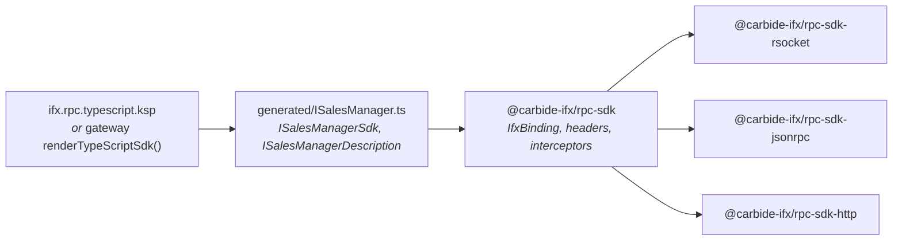

# TypeScript SDK

Browsers and Node clients call Carbide services through generated TypeScript SDKs. The design mirrors the
Kotlin side exactly: a **generated contract** that knows the operations, and a **separately chosen
protocol package** that knows the wire.



## Packages

An npm workspace under `typescript/`.

### `@carbide-ifx/rpc-sdk`

The protocol-neutral runtime. It contains **no network code**, which is why choosing a protocol is an
explicit second install rather than a hidden default.

```ts
export interface IfxBinding {
  fireAndForget(operation: string, request?: unknown): Promise<void>;
  requestResponse<Response>(operation: string, request?: unknown): Promise<Response>;
  requestStream<Response>(operation: string, request?: unknown): AsyncIterable<Response>;
  close(): void;
}

export interface IfxServiceConstructor<Sdk> {
  readonly address: string;
  new (binding: IfxBinding): Sdk;
}
```

That is the same three-interaction shape as Kotlin's `IBinding`, with `AsyncIterable` standing in for
`Flow`. Also here: `IfxMessage` (`header` / `body`, matching the Kotlin wire model), outbound
interceptors, header providers, service descriptions, and `GatewayError` / `decodeGatewayError` for
canonical gateway failures.

```ts
export interface IfxBindingOptions {
  readonly headers?: IfxHeaders | IfxHeaderProvider;
  readonly interceptors?: readonly IfxOutboundInterceptor[];
}
```

`IfxHeaderProvider` is a function returning headers, possibly asynchronously — the intended hook for a
token that must be refreshed per call rather than captured once at connect time.

### `@carbide-ifx/rpc-sdk-rsocket`

RSocket over WebSocket. Owns the RSocket and WebSocket dependencies and supports **all three**
interaction types, including request streams. This is what the Service Explorer uses.

Upstream RSocket dependencies are pinned to `1.0.0-alpha.3`; that API is still alpha.

### `@carbide-ifx/rpc-sdk-jsonrpc`

JSON-RPC 2.0 over Fetch. Supports notifications (fire-and-forget) and request/response. A request
stream **fails explicitly** — JSON-RPC over HTTP has no standard streaming interaction, so the SDK
refuses rather than emulating one.

### `@carbide-ifx/rpc-sdk-http`

The conventional HTTP binding for a **gateway projection**, not for JSON-RPC. Kept separate on purpose:
URLs, envelopes, error shapes, fire-and-forget responses, and streaming all differ between the two.
It accepts ordinary Fetch request headers for browser authentication and decodes NDJSON incrementally,
so a stream renders as it arrives.

### `ifx-test-ui`

The Service Explorer frontend. An ordinary npm application whose build writes `dist/`, then
synchronizes JVM resources and regenerates the compressed Native asset projection inside
`ifx.service.explorer`. It reads the catalog from `IActuator.catalog()` over RSocket — there is no
separate HTTP catalog endpoint.

## Connecting

The protocol entrypoint appends the generated service address to its base URL; the generated SDK
sends the exact Kotlin operation signatures through the chosen binding.

```ts
import { RSocketSdk } from "@carbide-ifx/rpc-sdk-rsocket";
import { JsonRpcSdk } from "@carbide-ifx/rpc-sdk-jsonrpc";
import { ISalesManagerSdk } from "./generated/ISalesManager";

const streamingSdk = await RSocketSdk.connect(ISalesManagerSdk, "ws://localhost:7000");
const jsonRpcSdk = await JsonRpcSdk.connect(ISalesManagerSdk, "http://localhost:7001");

try {
  for await (const product of streamingSdk.listProducts()) {
    console.log(product);
  }
} finally {
  streamingSdk.close();
  jsonRpcSdk.close();
}
```

For a gateway surface, connect the projection's SDK instead:

```ts
import { HttpSdk } from "@carbide-ifx/rpc-sdk-http";
import { ProductWebSdk } from "./ProductWeb";

const sdk = await HttpSdk.connect(ProductWebSdk, "https://api.example.com", {
  requestHeaders: async () => ({ Authorization: `Bearer ${await accessToken()}` }),
});
```

## Two generators, two audiences

| Generator | Input | Output | Use for |
| --- | --- | --- | --- |
| `ifx.rpc.typescript.ksp` | every reachable `IService` contract | one file per service: interface, request/response aliases, all reachable types, `{Service}Description`, `{Service}Sdk` | internal tools and first-party clients that may call any service |
| `renderTypeScriptSdk()` / `gatewayArtifacts` | one `GatewayProjection` | one SDK with manager namespaces and only the projected operations | a public or partner-facing surface |

Both consume the canonical service schema built by `ifx.rpc.schema.ksp`, directly during KSP for
per-service SDKs and through compiled `ServiceDescription` values for gateway SDKs. They can coexist
without independently interpreting Kotlin wire types.

## Constraints on generated types

Request and response types must be `@Serializable`. **Custom and contextual serializers are rejected**
by the generator: their wire shape cannot be inferred from KSP symbols, and emitting a guess would
produce TypeScript that type-checks and then fails at runtime. Change the Kotlin type or write the
binding by hand instead.

## `{Service}Description`

Every generated contract exports a `{Service}Description` value alongside its typed SDK, containing
the same operations and runtime wire schema the hosted Service Explorer uses. TypeScript types are
erased at runtime, so a tool that wants to build a form, validate a payload, or enumerate operations
cannot reflect on the SDK — it reads the description instead. This is how the Service Explorer
generates request controls for a service it has never seen.
